# FlashCards

> Ứng dụng học thẻ từ vựng đa ngôn ngữ, tích hợp Spaced Repetition System và AI (Google Gemini) — chạy trên Windows.


---

## Mục lục

- [Giới thiệu](#giới-thiệu)
- [Screenshots](#screenshots)
- [Kiến trúc hệ thống](#kiến-trúc-hệ-thống)
- [Tính năng](#tính-năng)
- [Yêu cầu hệ thống](#yêu-cầu-hệ-thống)
- [Cài đặt và chạy](#cài-đặt-và-chạy)
- [Cấu trúc dự án](#cấu-trúc-dự-án)
- [Cấu trúc dữ liệu học phần](#cấu-trúc-dữ-liệu-học-phần)
- [Thuật toán SRS](#thuật-toán-srs)
- [Ngôn ngữ và giọng đọc hỗ trợ](#ngôn-ngữ-và-giọng-đọc-hỗ-trợ)
- [Tích hợp AI](#tích-hợp-ai)
- [Đóng gói và phát hành](#đóng-gói-và-phát-hành)

---

## Giới thiệu

**FlashCards** là ứng dụng học từ vựng desktop trên Windows, được xây dựng theo kiến trúc lai: giao diện Web hiện đại (HTML5 / CSS3 / Vanilla JS) chạy trong **Microsoft WebView2**, kết hợp với lớp host viết bằng **C# WinForms (.NET 8)** để xử lý dữ liệu, phát âm và gọi API.

Ứng dụng nhắm đến người học ngoại ngữ cần hệ thống ôn tập có lịch trình khoa học, không phụ thuộc vào kết nối mạng để sử dụng các chức năng cốt lõi, và muốn tận dụng AI để tạo nội dung học tập phong phú.

---

## Screenshots

### Splash Screen — Khởi động ứng dụng

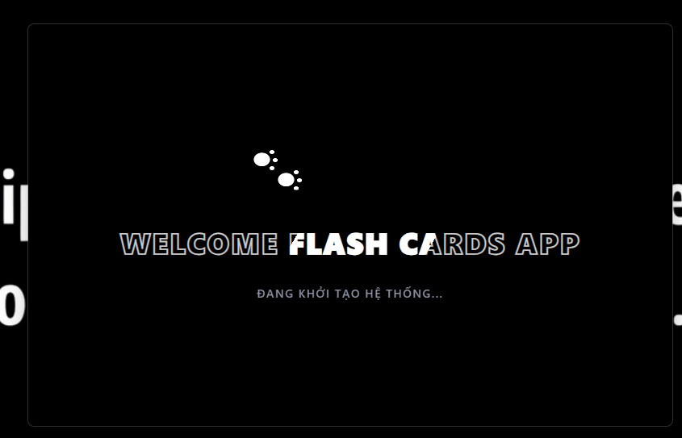

> Màn hình chờ xuất hiện trong khi hệ thống khởi tạo WebView2 và nạp dữ liệu. Tự động đóng khi ứng dụng sẵn sàng.

---

### Trang chủ — Danh sách học phần

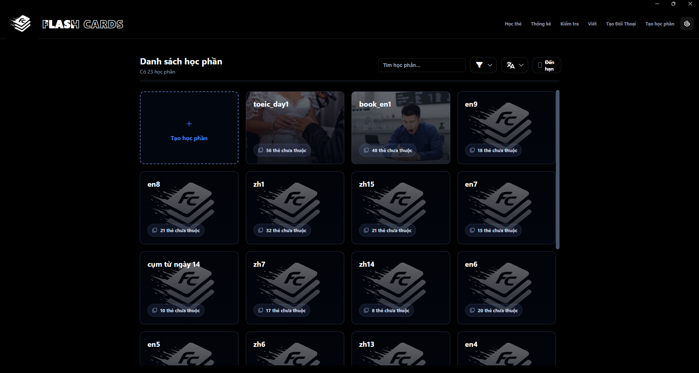

> Giao diện chính hiển thị toàn bộ học phần dạng thẻ Grid. Thanh điều hướng trên cùng cho phép truy cập nhanh **Học thẻ**, **Thống kê**, **Kiểm tra**, **Viết**, **Tạo Đối Thoại**, **Tạo học phần**. Bộ lọc bên phải cho phép tìm kiếm, lọc ngôn ngữ và bật checkbox **Đến hạn** để chỉ hiển thị học phần có thẻ cần ôn hôm nay.

---

### Tạo học phần — Import từ vựng

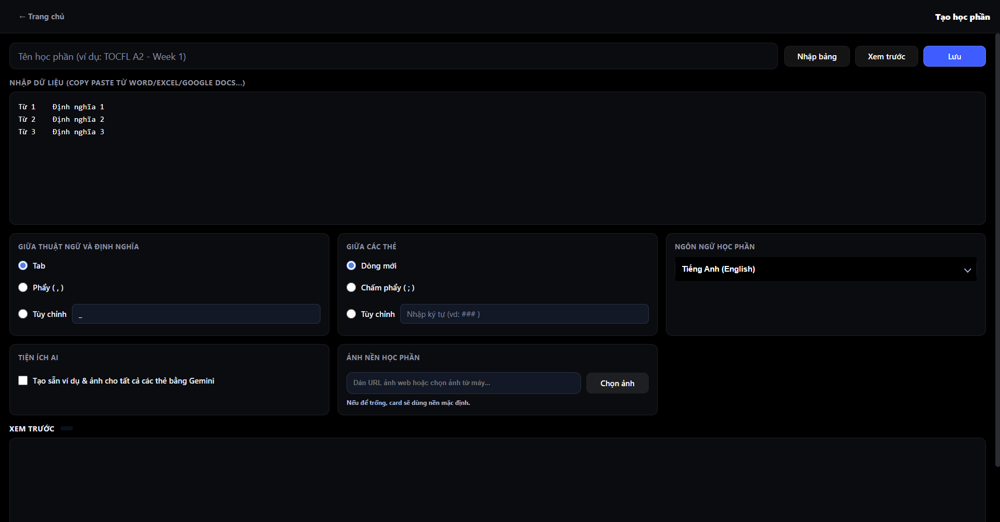

> Giao diện tạo học phần mới. Hỗ trợ dán dữ liệu trực tiếp từ Word / Excel / Google Docs theo định dạng tab-separated. Cấu hình dấu phân cách thuật ngữ, phân cách thẻ, ngôn ngữ học phần và tùy chọn tạo sẵn ví dụ bằng Gemini AI.

---

### Học thẻ (Flashcards) — Mặt trước thẻ

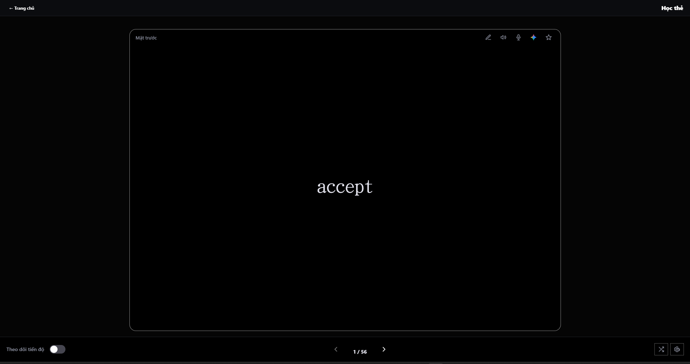

> Giao diện học thẻ tối giản. Thẻ hiện mặt trước (từ vựng), bấm để lật xem nghĩa. Thanh công cụ trên thẻ cung cấp các nút sửa thẻ, phát âm TTS, ghi âm, tạo ví dụ Gemini và đánh dấu sao. Phím tắt điều hướng và nút tiến độ SRS ở dưới cùng.

---

### Kiểm tra — Thiết lập bài kiểm tra

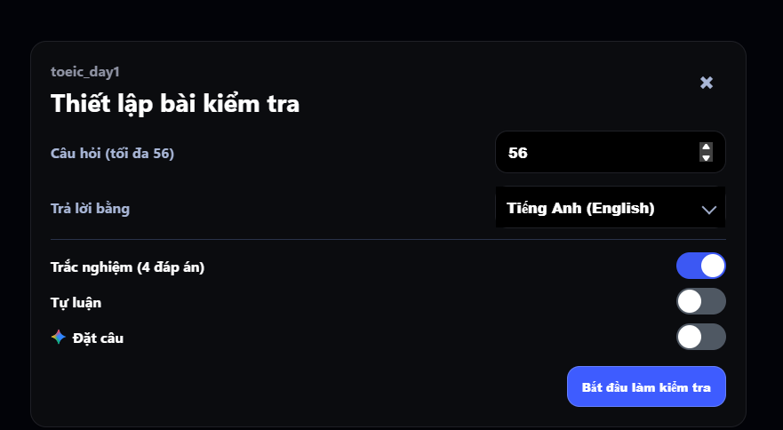

> Hộp thoại cấu hình bài kiểm tra trước khi bắt đầu. Cho phép chỉnh số câu hỏi, ngôn ngữ trả lời, và bật/tắt từng chế độ: **Trắc nghiệm** (4 đáp án), **Tự luận** (điền text), **Đặt câu** (AI xếp từ).

---

### Kiểm tra — Trắc nghiệm 4 đáp án

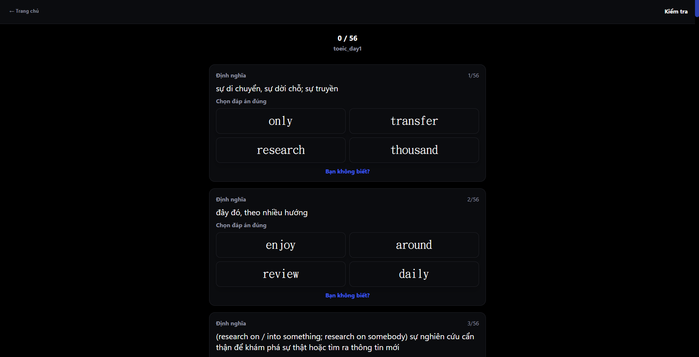

> Giao diện làm bài trắc nghiệm. Hiển thị định nghĩa tiếng Việt, người học chọn từ vựng đúng trong 4 đáp án. Các câu xếp chồng cuộn dọc, tiến trình hiển thị dạng `X / Tổng`.

---

### Luyện hội thoại AI (Dialogue)

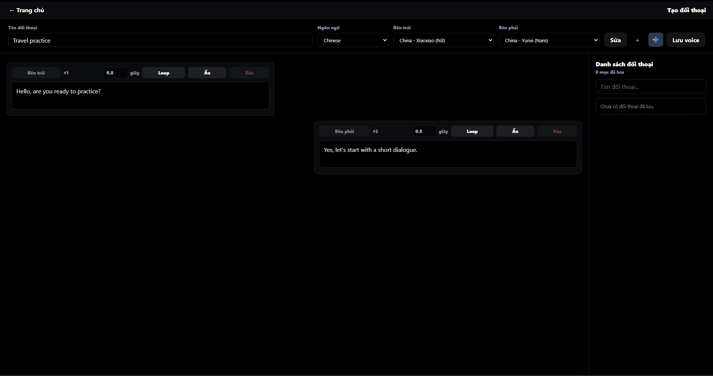

> Gemini AI tạo hội thoại hai chiều. Mỗi lượt thoại (trái/phải) có điều khiển thời gian dừng, chế độ Loop và ẩn. Thanh trên cùng cho phép chọn ngôn ngữ, giọng đọc nam/nữ độc lập cho hai bên. Lịch sử hội thoại đã lưu hiện ở cột phải.

---

### Luyện viết cùng AI (Writing Practice)

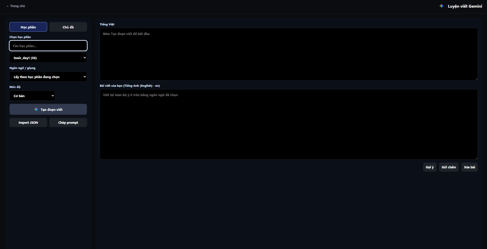

> Gemini AI tạo đoạn văn tiếng Việt (hiển thị trên), người học dịch và viết lại bằng ngôn ngữ đích vào khung bên dưới. Chọn học phần hoặc chủ đề tự do, mức độ khó (Cơ bản / Khó / Nâng cao). Nút **Gợi ý** gọi AI xem trước ý chính, nút **Gửi chấm** gọi AI chấm điểm và highlight lỗi.

---

### Dashboard Thống kê học tập

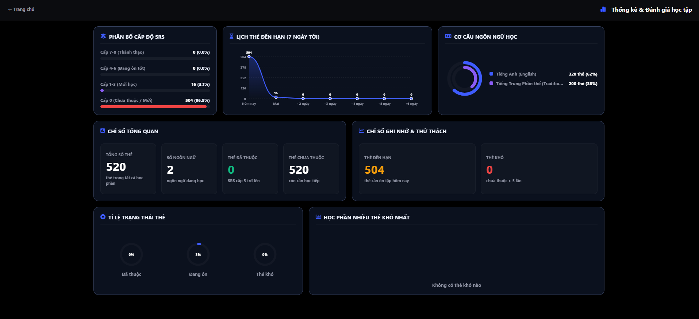

> Dashboard tổng quan với 6 widget thống kê trực quan. Hàng trên: **Phân bổ cấp độ SRS** (bar chart ngang), **Lịch thẻ đến hạn 7 ngày** (biểu đồ sóng Bezier SVG), **Cơ cấu ngôn ngữ** (vòng tròn đồng tâm SVG). Hàng giữa: **Chỉ số tổng quan** (số liệu lớn: tổng thẻ, ngôn ngữ, đã thuộc, chưa thuộc), **Chỉ số ghi nhớ & thử thách** (thẻ đến hạn hôm nay, thẻ khó). Hàng dưới: **Tỷ lệ trạng thái** (3 đồng hồ tròn SVG), **Học phần nhiều thẻ khó nhất** (bar chart dọc).

---

## Kiến trúc hệ thống

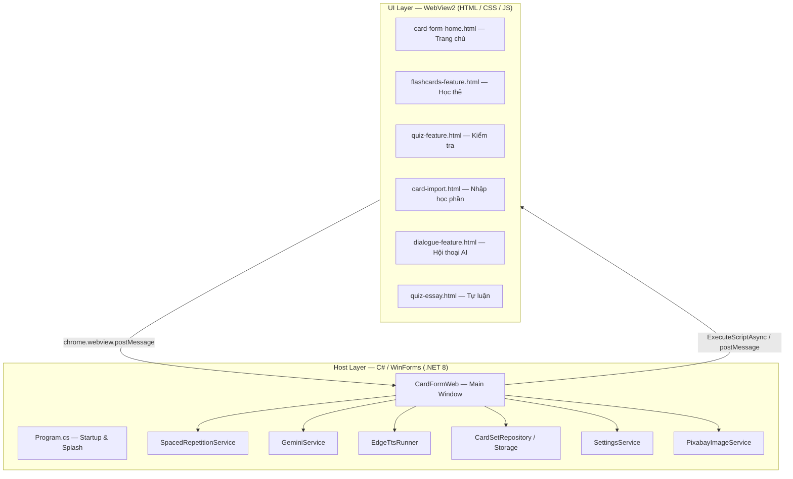

### Luồng khởi động

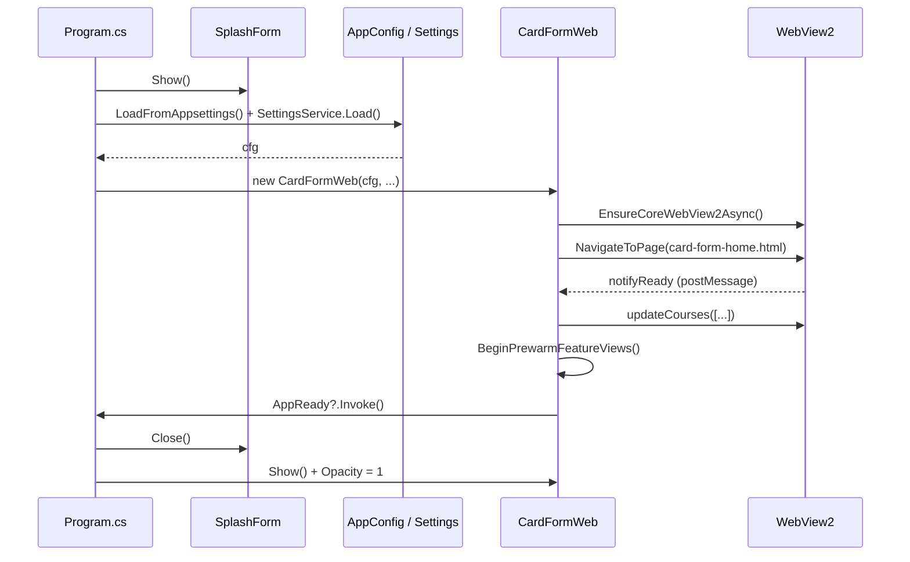

---

## Tính năng

### Quản lý học phần

| Tính năng | Mô tả |
|---|---|
| Trang chủ Grid | Danh sách học phần dạng thẻ, ảnh bìa tùy chỉnh |
| Tìm kiếm | Tìm kiếm từ khóa real-time gửi về C# để lọc |
| Sắp xếp | Mặc định, Tên A→Z, Tên Z→A, Số thẻ tăng/giảm dần |
| Lọc ngôn ngữ | Dropdown lọc theo ngôn ngữ học phần |
| Lọc đến hạn | Checkbox ẩn học phần không có thẻ đến hạn SRS |
| Nhập học phần | Hỗ trợ file `.txt` (tab-separated), JSON, Excel (`.xlsx`) |
| Ảnh bìa | Chọn ảnh từ máy, tạo ảnh bằng Gemini AI |
| Xóa / Sửa | Xóa học phần, chỉnh sửa tên, ngôn ngữ, ảnh bìa |

### Học thẻ (Flashcards)

| Tính năng | Mô tả |
|---|---|
| Lật thẻ 3D | Hiệu ứng lật thẻ 3D mượt mà trên WebView2 |
| Phát âm TTS | Phát âm từ vựng qua Microsoft Edge TTS (không cần mạng sau khi cài) |
| Tự động phát | Chế độ Auto-play toàn bộ học phần |
| Đánh dấu sao | Đánh dấu thẻ quan trọng để lọc riêng |
| SRS Review | Nút Đúng/Sai cập nhật mức độ SRS và ngày ôn tiếp theo |
| Ví dụ Gemini | Tạo câu ví dụ, gợi ý ghi nhớ, prompt ảnh bằng Gemini AI |
| Hình ảnh | Tìm ảnh minh họa từ Pixabay theo từ khóa do Gemini đề xuất |
| Toàn màn hình | F11 để vào/thoát chế độ toàn màn hình |
| Cài đặt | Tùy chọn chế độ học (Mặt trước/sau, thứ tự, số lượng thẻ) |

### Kiểm tra (Quiz)

| Chế độ | Mô tả |
|---|---|
| Trắc nghiệm | Câu hỏi nhiều lựa chọn từ từ vựng học phần |
| Điền từ | Người học điền đáp án dạng text |
| Xếp câu (AI) | Gemini tạo câu hoàn chỉnh, người học sắp xếp lại từ đúng thứ tự |
| Tự luận (AI) | Gemini tạo câu hỏi mở, chấm điểm bài viết tự luận |

### Luyện hội thoại AI (Dialogue)

- Gemini tạo hội thoại hai chiều (left/right) từ từ vựng học phần hoặc chủ đề tự do
- Phát âm tuần tự từng lượt với Edge TTS (2 giọng nam/nữ độc lập)
- Chọn chủ đề, ngôn ngữ đích, số lượng lượt thoại
- Lưu lịch sử các hội thoại đã tạo

### Luyện viết cùng AI (Writing Practice)

- Tạo đoạn văn từ từ vựng học phần hoặc chủ đề tự nhập
- Ba mức độ khó: Cơ bản / Khó / Nâng cao
- Chấm điểm bài viết trên thang 100 điểm
- Highlight trực tiếp lỗi ngữ pháp/chính tả trong bài
- Đề xuất bài viết mẫu và giải thích từng lỗi
- Xem gợi ý ý chính, từ vựng, cấu trúc trước khi viết

### Dashboard Thống kê

| Widget | Mô tả |
|---|---|
| Tổng quan | Tổng số thẻ, số ngôn ngữ, thẻ đến hạn, thẻ khó (lapse > 5) |
| Level Distribution | Biểu đồ ngang phân nhóm thẻ theo 4 trạng thái SRS |
| Due Timeline | Biểu đồ sóng Bezier SVG — số thẻ đến hạn trong 7 ngày tới |
| Language Rings | Biểu đồ vòng tròn đồng tâm SVG — tỷ lệ thẻ theo ngôn ngữ |
| Study Gauges | Ba đồng hồ tròn SVG — tỷ lệ Đã thuộc / Đang ôn / Thẻ khó |
| Hard Courses | Biểu đồ cột — Top 5 học phần có nhiều thẻ khó nhất |

### Thông báo nổi (Vocab Toast)

- Hiển thị popup từ vựng ngẫu nhiên theo lịch (mỗi N phút)
- Cấu hình thời gian hiển thị, khoảng cách, bỏ qua từ đã thuộc
- Hoạt động ngầm khi dùng ứng dụng khác

---

## Yêu cầu hệ thống

| Thành phần | Yêu cầu |
|---|---|
| Hệ điều hành | Windows 10 (1903+) hoặc Windows 11 |
| Runtime | [.NET 8.0 Runtime](https://dotnet.microsoft.com/download/dotnet/8.0) |
| WebView2 | [Microsoft WebView2 Runtime](https://developer.microsoft.com/en-us/microsoft-edge/webview2/) (tự động tải khi cài bằng installer) |
| Phát âm TTS | `edge-tts` Python package (`pip install edge-tts`) — cần có Python trong PATH |
| AI (tùy chọn) | Google Gemini API Key |
| Hình ảnh (tùy chọn) | Pixabay API Key |

---

## Cài đặt và chạy

### Chạy từ mã nguồn

```bash
# Clone hoặc tải mã nguồn về
cd TocflQuiz

# Build và chạy
dotnet run

# Hoặc build Release
dotnet build -c Release
```

### Cài đặt bằng Installer (Inno Setup)

```bash
# 1. Build ứng dụng
.\publish.bat

# 2. Biên dịch installer với Inno Setup Compiler
# Mở TocflQuiz_Setup.iss và chọn Build > Compile
# Output: InstallerOutput\FlashCards_Setup_v1.0.11.exe
```

Installer sẽ tự động kiểm tra và tải WebView2 Runtime nếu chưa cài.

### Cài edge-tts để phát âm

```bash
pip install edge-tts
```

Sau khi cài, kiểm tra bằng: `edge-tts --version`

### Cấu hình API Keys

Mở ứng dụng > Nút **Cài đặt API** ở góc trên phải > Dán API Key vào ô tương ứng.

Cài đặt được lưu tại: `%LocalAppData%\FlashCards\settings.json`

---

## Cấu trúc dự án

```
TocflQuiz/
├── Forms/
│   ├── CardFormWeb.cs                  # Form chính — khai báo fields, constructor
│   ├── CardFormWeb.WebView.cs          # Khởi tạo WebView2, xử lý postMessage
│   ├── CardFormWeb.CourseActions.cs    # Gửi dữ liệu courses, Dashboard stats
│   ├── CardFormWeb.FeatureHost.cs      # Quản lý WinForms overlay, prewarm views
│   ├── CardFormWeb.Navigation.cs       # BackToHome, HandleShowFeature
│   ├── CardFormWeb.Writing.cs          # Xử lý Writing Practice với Gemini
│   ├── CardFormWeb.ThemeToast.cs       # Theme dark/light, Vocab Toast
│   ├── CardFormWeb.TitleBar.cs         # Title bar tùy chỉnh
│   ├── CardFormWeb.FullScreen.cs       # F11 fullscreen logic
│   └── SplashForm.cs                   # Splash screen khi khởi động
│
├── Controls/Features/
│   ├── FlashcardsFeatureControlWeb.cs  # UserControl học thẻ
│   ├── FlashcardsFeatureControlWeb.AudioTts.cs   # Edge TTS integration
│   ├── FlashcardsFeatureControlWeb.Gemini.cs     # Tạo ví dụ, hình ảnh AI
│   ├── FlashcardsFeatureControlWeb.Review.cs     # SRS review logic
│   ├── FlashcardsFeatureControlWeb.Progress.cs   # Lưu tiến độ
│   ├── FlashcardsFeatureControlWeb.WebBridge.cs  # WebView bridge
│   ├── DialogueFeatureControlWeb.cs    # Hội thoại AI với TTS
│   ├── QuizFeatureControlWeb.cs        # Kiểm tra trắc nghiệm / xếp câu
│   └── CreateCourseFeatureControl.cs   # Import học phần mới
│
├── Services/
│   ├── GeminiService.cs                # Tất cả cuộc gọi Gemini API (54KB)
│   ├── EdgeTtsRunner.cs                # Chạy edge-tts CLI, cache MP3
│   ├── SpacedRepetitionService.cs      # SRS: ApplyReview, CountDue, BuildStatus
│   ├── CardSetRepository.cs            # Đọc/ghi học phần từ file system
│   ├── CardSetStorage.cs               # Facade cho Repository
│   ├── CardSetTextParser.cs            # Parse file .txt tab-separated và JSON
│   ├── CardImportParser.cs             # Parse nhiều định dạng import
│   ├── CardImportSubmissionService.cs  # Lưu học phần sau khi import
│   ├── PixabayImageService.cs          # Tìm kiếm hình ảnh Pixabay
│   ├── CourseAudioService.cs           # Cache và phát audio học phần
│   ├── SettingsService.cs              # Đọc/ghi settings.json
│   ├── ContentScanner.cs               # Quét thư mục dataset
│   └── WebViewAssetService.cs          # Serve file local cho WebView2
│
├── Models/
│   ├── CardSet.cs                      # CardSet + CardItem data models
│   ├── CardSetConfig.cs                # Cấu hình học phần (config.json)
│   └── AppConfig.cs                    # Cấu hình ứng dụng từ appsettings.json
│
├── Webviews/
│   ├── card-form-home.html             # Trang chủ — Sidebar + Grid + Dashboard
│   ├── flashcards-feature.html         # Giao diện học thẻ
│   ├── quiz-feature.html               # Giao diện kiểm tra
│   ├── quiz-essay.html                 # Giao diện tự luận
│   ├── card-import.html                # Giao diện nhập học phần
│   ├── dialogue-feature.html           # Giao diện hội thoại AI
│   └── src/
│       ├── card-form-home.css/.js      # Logic và style trang chủ
│       ├── course-hub.*.js             # Render, actions, bridge, dashboard
│       ├── flashcards-*.css/.js        # Học thẻ: state, render, audio, settings
│       ├── quiz-feature.*.js           # Kiểm tra: state, setup, render, bridge
│       ├── dialogue-feature.css/.js    # Hội thoại AI
│       └── unified-ui.css             # Design system chung — variables, animations
│
├── appsettings.json                    # Cấu hình gốc (DatasetRoot, SRS intervals)
├── TocflQuiz.csproj                    # Project file (.NET 8, WinForms)
├── TocflQuiz_Setup.iss                 # Inno Setup script
└── publish.bat                         # Script publish Release
```

---

## Cấu trúc dữ liệu học phần

Mỗi học phần là một **thư mục** chứa các file sau:

```
Dataset/
└── Ten_Hoc_Phan/
    ├── config.json          # Metadata học phần
    ├── vocabs/
    │   ├── vocab.json       # Danh sách thẻ + dữ liệu SRS
    │   └── notyet.json      # Bản sao thẻ đang học (subset)
    └── cover.jpg            # Ảnh bìa (tùy chọn)
```

### config.json

```json
{
  "title": "Từ vựng TOCFL A1",
  "language": "Tiếng Trung phồn thể",
  "languageCode": "zh-TW",
  "vocabCount": 120,
  "createdAt": "2024-01-15",
  "relativeVocabPath": "vocabs/vocab.json",
  "relativeNotYetPath": "vocabs/notyet.json",
  "coverImagePath": "cover.jpg"
}
```

### vocab.json — Cấu trúc một thẻ (CardItem)

```json
{
  "term": "學習",
  "definition": "học tập, việc học",
  "pinyin": "xué xí",
  "isStarred": false,
  "srsLevel": 3,
  "srsDueDate": "2024-02-10",
  "srsLastReviewedAt": "2024-01-31",
  "srsReviewCount": 7,
  "srsLapseCount": 1
}
```

### Định dạng import được hỗ trợ

| Định dạng | Mô tả |
|---|---|
| TSV (tab-separated) | `term\tdefinition` hoặc `term\tdefinition\tpinyin` mỗi dòng |
| JSON array | `[{"term":"...","definition":"...","pinyin":"..."}]` |
| JSON CardSet | Object có field `items` chứa array thẻ |
| Excel `.xlsx` | Cột đầu: term, cột hai: definition, cột ba (tùy chọn): pinyin |

---

## Thuật toán SRS

Spaced Repetition System (SM-2 simplified) với 9 mức độ:

| Mức (SrsLevel) | Khoảng cách ôn tiếp theo |
|---|---|
| 0 | Hôm nay (mới / chưa thuộc) |
| 1 | 1 ngày |
| 2 | 3 ngày |
| 3 | 7 ngày |
| 4 | 14 ngày |
| 5 | 30 ngày |
| 6 | 60 ngày |
| 7 | 120 ngày |
| 8 | 240 ngày |

**Khi trả lời Đúng**: `SrsLevel` tăng 1, tính ngày ôn tiếp theo.  
**Khi trả lời Sai**: `SrsLevel` về 0, `SrsLapseCount` tăng 1.  
**Thẻ khó**: `SrsLapseCount > 5` — dùng trong Dashboard để theo dõi.

---

## Ngôn ngữ và giọng đọc hỗ trợ

| Ngôn ngữ | Giọng Nữ | Giọng Nam |
|---|---|---|
| Tiếng Trung (CN) | zh-CN-XiaoxiaoNeural | zh-CN-YunxiNeural |
| Tiếng Trung (TW) | zh-TW-HsiaoChenNeural | zh-TW-YunJheNeural |
| Tiếng Anh (US) | en-US-JennyNeural | en-US-GuyNeural |
| Tiếng Anh (UK) | en-GB-SoniaNeural | en-GB-RyanNeural |
| Tiếng Việt | vi-VN-HoaiMyNeural | vi-VN-NamMinhNeural |
| Tiếng Nhật | ja-JP-NanamiNeural | ja-JP-KeitaNeural |
| Tiếng Hàn | ko-KR-SunHiNeural | ko-KR-InJoonNeural |
| Tiếng Đức | de-DE-KatjaNeural | de-DE-ConradNeural |
| Tiếng Pháp | fr-FR-DeniseNeural | fr-FR-HenriNeural |
| Tiếng Tây Ban Nha | es-ES-ElviraNeural | es-ES-AlvaroNeural |
| Tiếng Nga | ru-RU-SvetlanaNeural | ru-RU-DmitryNeural |

---

## Tích hợp AI

### Google Gemini API

Cấu hình model mặc định: `gemini-flash-lite-latest`

| Chức năng | Mô tả | Nhiệt độ |
|---|---|---|
| Tạo ví dụ từ vựng | 2–4 câu ví dụ tự nhiên + ghi chú sử dụng | 0.65 |
| Tạo ví dụ hàng loạt | Tạo ví dụ cho toàn bộ học phần (20 từ/request) | 0.65 |
| Tạo quiz xếp câu | N câu hoàn chỉnh để học sinh sắp xếp lại từ | 0.70 |
| Tạo hội thoại | Hội thoại 2 chiều N lượt từ từ vựng/chủ đề | 0.75 |
| Tạo đoạn viết | Đoạn văn tiếng Việt + bản dịch ngôn ngữ đích | 0.72 |
| Chấm bài viết | Điểm /100 + phản hồi + highlight lỗi | 0.20 |
| Gợi ý viết | Ý chính, từ vựng, cấu trúc câu gợi ý | 0.35 |
| Chấm tự luận | Đánh giá câu trả lời tự luận trong quiz | 0.20 |
| Tạo hình ảnh | Ảnh minh họa từ vựng (model image riêng) | — |

### Pixabay Image API

Tìm ảnh minh họa cho từ vựng dựa trên `imagePrompt` do Gemini đề xuất. Ảnh được cache cục bộ theo học phần.

---

## Đóng gói và phát hành

### Publish tự động

```bash
.\publish.bat
# Output: bin\Publish\
```

Script thực hiện: `dotnet clean` → `dotnet restore` → `dotnet publish -c Release -f net8.0-windows -r win-x64 --self-contained false`

### Tạo installer

Mở `TocflQuiz_Setup.iss` bằng **Inno Setup Compiler** và nhấn **Build > Compile**.

Installer tự động:
- Kiểm tra WebView2 Runtime đã cài chưa
- Tải và cài WebView2 tự động nếu thiếu
- Tạo shortcut Start Menu và tùy chọn shortcut Desktop

Output: `InstallerOutput\FlashCards_Setup_v1.0.11.exe`

### Thư mục dữ liệu người dùng

| Thư mục | Mô tả |
|---|---|
| `%LocalAppData%\FlashCards\` | Thư mục dữ liệu ứng dụng |
| `%LocalAppData%\FlashCards\settings.json` | API keys, cài đặt người dùng |
| `%LocalAppData%\FlashCards\WebView2\` | Cache WebView2 |
| `%LocalAppData%\FlashCards\Dataset\` | Thư mục học phần mặc định |
| `%LocalAppData%\FlashCards\gemini_examples\` | Cache ví dụ Gemini |
| `%LocalAppData%\FlashCards\gemini_sentences\` | Cache câu quiz Gemini |
| `%Temp%\FlashCardsTTS\` | File MP3 tạm của Edge TTS |
